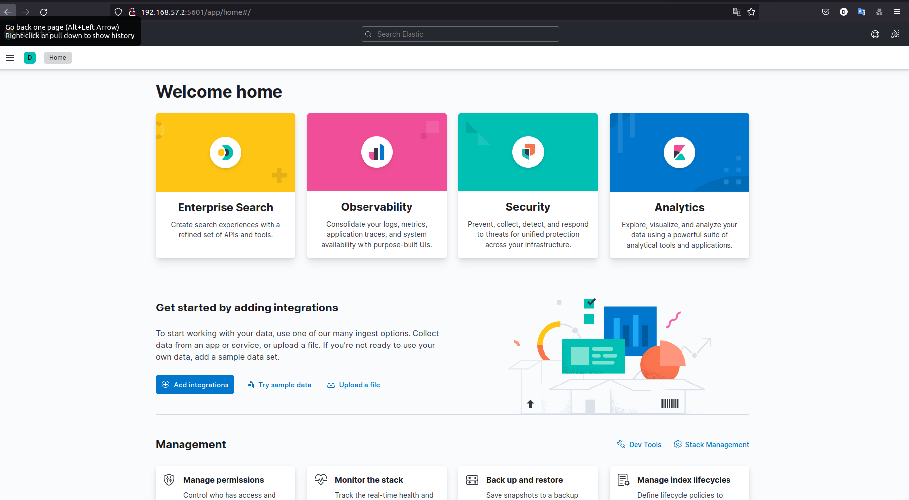

# SUIVI_INFRA_SI

Ce repository contient une documentation d'installation ainsi qu'un guide d'utilisation de la solution choisie (pour les OS ubuntu_22_04_LTS) dans le README.

Il contient également un répertoire pour les fichiers de configurations et pour les captures d'écrans.

## RSYSLOG: INSTALLATION ET CONFIGURATION

**INSTALLATION**

- Installez rsyslog
```
sudo apt install rsyslog
```

**CONFIGURATION**

- Modifiez le fichier rsyslog.conf comme ci-dessous pour écouter sur le port 514
```
# provides UDP syslog reception
module(load="imudp")
input(type="imudp" port="514")
```

- Lancez Rsyslog et et faites en sotre qu'il se lance à chaque démarage
```
sudo systemctl start rsyslog
sudo systemctl enable rsyslog
```

- Modifiez le fichier 50-default.conf comme ci-dessous pour envoyer les logs d'authentification
```
auth,authpriv.*                 @192.168.57.4:514
```

- Pour les logs d'apache2 allez dans /etc/apache2/sites-available et modifiez le 000-default.conf comme ci-dessous
```
#LogLevel info ssl:info

	ErrorLog "|/usr/bin/logger -t apache -p local6.info"
	CustomLog "|/usr/bin/logger -t apache -p local6.info" combined

	#ErrorLog ${APACHE_LOG_DIR}/error.log
	#CustomLog ${APACHE_LOG_DIR}/access.log combined
```

- Envoyez les logs d'apache à rsyslog (dans le fichier 50-default.conf) ajoutez comme ci-dessous
```
#Personal logs
auth,authpriv.*                 @192.168.57.4:514
local6.*                        @192.168.57.4:514
```

- Redémarez les services rsyslog et apache2 sur le serveur et le client 

### ELASTICSEARCH: INSTALLATION ET CONFIGURATION
PRÉREQUIS: - java-11

**INSTALLATION**

- Importez la clé GPG publique d'Elasticsearch dans APT
```
curl -fsSL https://artifacts.elastic.co/GPG-KEY-elasticsearch |sudo gpg --dearmor -o /usr/share/keyrings/elastic.gpg
```

- Ajoutez la liste des sources élastiques au sources.list.d
```
echo "deb [signed-by=/usr/share/keyrings/elastic.gpg] https://artifacts.elastic.co/packages/7.x/apt stable main" | sudo tee -a /etc/apt/sources.list.d/elastic-7.x.list
```

- Mettez à jours vos paquets
```
sudo apt update
```

- Installez elastic
```
sudo apt install elasticsearch
```

**CONFIGURATION**

- Modifiez le elasticsearch.yml
```
sudo vim /etc/elasticsearch/elasticsearch.yml
```

- Changez les paramètres suivants comme ci-dessous (adaptez vos informations si besoin)
```
node.name: node-1
path.data: /var/lib/elasticsearch
path.logs: /var/log/elasticsearch
network.host: 0.0.0.0
discovery.seed_hosts: ["192.168.57.2", "127.0.0.1"]    /!\à adapter
cluster.initial_master_nodes: ["node-1"]
```

- Lancez Elasticsearch et faites en sotre qu'il se lance à chaque démarage
```
sudo systemctl start elasticsearch
sudo systemctl enable elasticsearch
```

- Testez si votre service elasticsearch reçois vos requêtes
```
curl -X GET "localhost:9200"
```
```
{
  "name" : "node-1",
  "cluster_name" : "elasticsearch",
  "cluster_uuid" : "QV4XnHDMQMmGSeJuHMhSZg",
  "version" : {
    "number" : "7.17.3",
    "build_flavor" : "default",
    "build_type" : "deb",
    "build_hash" : "5ad023604c8d7416c9eb6c0eadb62b14e766caff",
    "build_date" : "2022-04-19T08:11:19.070913226Z",
    "build_snapshot" : false,
    "lucene_version" : "8.11.1",
    "minimum_wire_compatibility_version" : "6.8.0",
    "minimum_index_compatibility_version" : "6.0.0-beta1"
  },
  "tagline" : "You Know, for Search"
}
```

### KIBANA: INSTALLATION ET CONFIGURATION

**INSTALLATION**

- Installez Kibana
```
sudo apt install kibana
```

**CONFIGURATION**

- Modifiez le kibana.yml
```
sudo vim /etc/kibana/kibana.yml
```

- Changez les paramètres suivants comme ci-dessous (adaptez vos informations si besoin)
```
server.port: 5601
server.host: "0.0.0.0"
elasticsearch.hosts: ["http://localhost:9200"]
```

- Lancez Kibana et faites en sotre qu'il se lance à chaque démarage
```
sudo systemctl start kibana
sudo systemctl enable kibana
```

- Testez si Kibana fonctionne
```
http://ip_de_votre_server:5601
```



### LOGSTASH: INSTALLATION ET CONFIGURATION

**INSTALLATION**

- Installez Logstash
```
sudo apt install logstash
```

- Créez et modifiez un fichier de configuration appelé 02-beats-input.confoù vous configurerez votre entrée Filebeat 
```
sudo vim /etc/logstash/conf.d/02-beats-input.conf
```
```
input {
  beats {
    port => 5044
  }
}
```

- Ensuite, créez et modifiez un fichier de configuration appelé 30-elasticsearch-output.conf
```
sudo vim /etc/logstash/conf.d/30-elasticsearch-output.conf
```
```
output {
  if [@metadata][pipeline] {
	elasticsearch {
  	hosts => ["localhost:9200"]
  	manage_template => false
  	index => "%{[@metadata][beat]}-%{[@metadata][version]}-%{+YYYY.MM.dd}"
  	pipeline => "%{[@metadata][pipeline]}"
	}
  } else {
	elasticsearch {
  	hosts => ["localhost:9200"]
  	manage_template => false
  	index => "%{[@metadata][beat]}-%{[@metadata][version]}-%{+YYYY.MM.dd}"
	}
  }
}
```

- Testez votre configuration Logstash avec cette commande
```
sudo -u logstash /usr/share/logstash/bin/logstash --path.settings /etc/logstash -t
```
```
Config Validation Result: OK. Exiting Logstash
```

- Lancez Logstash et faites en sotre qu'il se lance à chaque démarage
```
sudo systemctl start logstash
sudo systemctl enable logstash
```

### FILEBEAT: INSTALLATION ET CONFIGURATION

**INSTALLATION**

- Istaller Filebeat
```
sudo apt install filebeat
```

**CONFIGURATION**

- Modifiez le filebeat.yml
```
sudo vim /etc/filebeat/filebeat.yml
```

- Commentez ces lignes
```
#output.elasticsearch:
  # Array of hosts to connect to.
  # hosts: ["localhost:9200"]
```

- Decommentez ces lignes
```
output.logstash:
  # The Logstash hosts
  hosts: ["192.168.57.2:5044"]
```

- Activez system pour les modules Filebeat
```
sudo filebeat modules enable system
```

- Listez les modules
```
sudo filebeat modules list
```

- Activez les piplines Filebeat
```
sudo filebeat setup --pipelines --modules system
```

- Chargez le modèle
```
sudo filebeat setup --index-management -E output.logstash.enabled=false -E 'output.elasticsearch.hosts=["localhost:9200"]'
```
```
Output
Index setup finished.
```

- Vérifiez les informations de version, chargez les tableaux de bord lorsque Logstash est activé, vous devez désactiver la sortie Logstash et activer la sortie Elasticsearch
```
sudo filebeat setup -E output.logstash.enabled=false -E output.elasticsearch.hosts=['localhost:9200'] -E setup.kibana.host=localhost:5601
```
```
Output
Overwriting ILM policy is disabled. Set `setup.ilm.overwrite:true` for enabling.

Index setup finished.
Loading dashboards (Kibana must be running and reachable)
Loaded dashboards
Setting up ML using setup --machine-learning is going to be removed in 8.0.0. Please use the ML app instead.
See more: https://www.elastic.co/guide/en/elastic-stack-overview/current/xpack-ml.html
Loaded machine learning job configurations
Loaded Ingest pipelines
```

- Lancez Filebeat et faites en sotre qu'il se lance à chaque démarage
```
sudo systemctl start filebeat
sudo systemctl enable filebeat
```

- Vérifiez que Elasticsearch reçois bien les donné via l'index Filebeat
```
 curl -XGET 'http://192.168.57.2:9200/filebeat-*/_search?pretty'
```
```
[...]
        "_index" : "filebeat-7.17.3-2022.05.23",
        "_type" : "_doc",
        "_id" : "-aA384AB4iRwmSobX9SJ",
        "_score" : 1.0,
        "_source" : {
          "agent" : {
            "hostname" : "syslog",
            "name" : "syslog",
            "id" : "3cff8496-bbd0-4395-993a-3d84e1ba7464",
            "type" : "filebeat",
            "ephemeral_id" : "5b8f3612-712e-4d07-ad61-ddbe68ddef72",
            "version" : "7.17.3"
          },
          "process" : {
            "name" : "sudo"
          },
          "_temp" : { },
          "log" : {
            "file" : {
              "path" : "/var/log/auth.log"
            },
            "offset" : 12140
          },
          "fileset" : {
            "name" : "auth"
          },
          "message" : "pam_unix(sudo:session): session opened for user root(uid=0) by adam(uid=1000)",
          "tags" : [
            "beats_input_codec_plain_applied"
          ],
          "input" : {
            "type" : "log"
          },
          "@timestamp" : "2022-05-23T22:47:08.000Z",
          "system" : {
            "auth" : { }
          },
          "ecs" : {
            "version" : "1.12.0"
          },
          "related" : {
            "hosts" : [
              "elk"
            ],
            "user" : [
              "adam",
              "root(uid=0)"
            ]
          },
          "service" : {
            "type" : "system"
          },
          "@version" : "1",
          "host" : {
            "hostname" : "elk",
            "os" : {
              "kernel" : "5.15.0-33-generic",
              "codename" : "jammy",
              "name" : "Ubuntu",
              "family" : "debian",
              "type" : "linux",
              "version" : "22.04 LTS (Jammy Jellyfish)",
              "platform" : "ubuntu"
            },
            "containerized" : false,
            "ip" : [
              "10.0.2.15",
              "fe80::a00:27ff:fe3f:50ac",
              "192.168.57.4",
              "fe80::a00:27ff:fe48:a3f0"
            ],
            "name" : "syslog",
            "id" : "05ff2b831dfc4876b480f38a7ef5e1b9",
            "mac" : [
              "08:00:27:3f:50:ac",
              "08:00:27:48:a3:f0"
            ],
            "architecture" : "x86_64"
          },
          "event" : {
            "ingested" : "2022-05-23T23:18:53.323803652Z",
            "timezone" : "+00:00",
            "kind" : "event",
            "module" : "system",
            "dataset" : "system.auth"
          },
          "user" : {
            "effective" : {
              "name" : "root(uid=0)"
            },
            "name" : "adam",
            "id" : "1000"
          }
        }
      }
    ]
  }
}
[...]
```

#### GUIDE D'UTILISATION

**RSYSLOG**

Le serveur Rsyslog centralise toutes les données qui lui sont envoyées.
Pour voir les logs d'authentification faites
```
sudo tail -f /var/log/auth.log
```
```
adam@syslog:~$ sudo tail -f /var/log/auth.log 
Jun  1 22:17:01 elk CRON[2484]: pam_unix(cron:session): session opened for user root(uid=0) by (uid=0)
Jun  1 22:17:02 elk CRON[2484]: pam_unix(cron:session): session closed for user root
Jun  1 22:18:20 elk sudo:     adam : TTY=pts/0 ; PWD=/home/adam ; USER=root ; COMMAND=/usr/bin/cat /etc/rsyslog.d/50-default.conf
Jun  1 22:18:20 elk sudo: pam_unix(sudo:session): session opened for user root(uid=0) by adam(uid=1000)
Jun  1 22:18:20 elk sudo: pam_unix(sudo:session): session closed for user root
Jun  1 22:20:08 web sudo:     adam : TTY=pts/0 ; PWD=/etc/apache2/sites-available ; USER=root ; COMMAND=/usr/bin/cat 000-default.conf
Jun  1 22:20:08 web sudo: pam_unix(sudo:session): session opened for user root(uid=0) by adam(uid=1000)
Jun  1 22:20:08 web sudo: pam_unix(sudo:session): session closed for user root
Jun  1 22:29:31 syslog sudo:     adam : TTY=pts/0 ; PWD=/home/adam ; USER=root ; COMMAND=/usr/bin/tail -f /var/log/auth.log
Jun  1 22:29:31 syslog sudo: pam_unix(sudo:session): session opened for user root(uid=0) by adam(uid=1000)
Jun  1 22:29:35 web sshd[1258]: Received disconnect from 192.168.57.1 port 46638:11: disconnected by user
Jun  1 22:29:35 web sshd[1258]: Disconnected from user adam 192.168.57.1 port 46638
Jun  1 22:29:35 web systemd-logind[666]: Session 1 logged out. Waiting for processes to exit.
Jun  1 22:29:35 web sshd[1147]: pam_unix(sshd:session): session closed for user adam
Jun  1 22:29:35 web systemd-logind[666]: Removed session 1.
```

Pour voir les logs d'apach2 faites
```
sudo tail -f /var/log/syslog
```
```
Jun  1 22:31:39 web apache: 192.168.57.1 - - [01/Jun/2022:22:31:39 +0000] "GET / HTTP/1.1" 200 3460 "-" "Mozilla/5.0 (X11; Linux x86_64; rv:101.0) Gecko/20100101 Firefox/101.0"
```

**KIBANA**

Une fois sur votre interace web vous pouvez cliquer sur les trois traits à gauche et aller dans discover


Une fois la partie discover comprise vous pouvez aller dans dashborad pour vous en créer un comme ci-dessous

